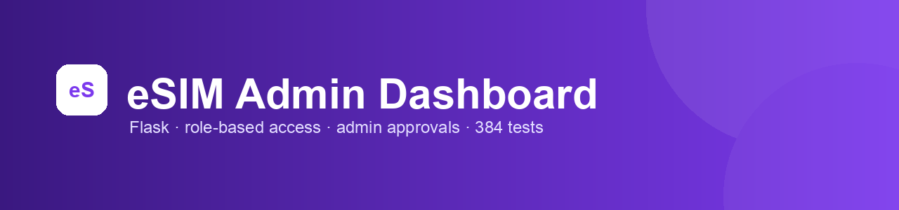
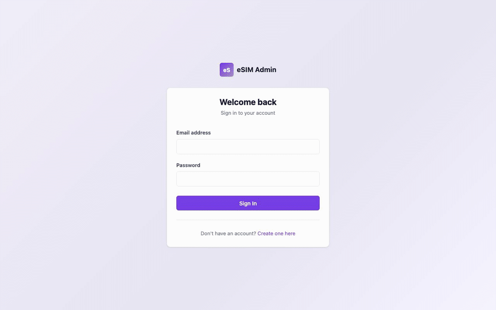
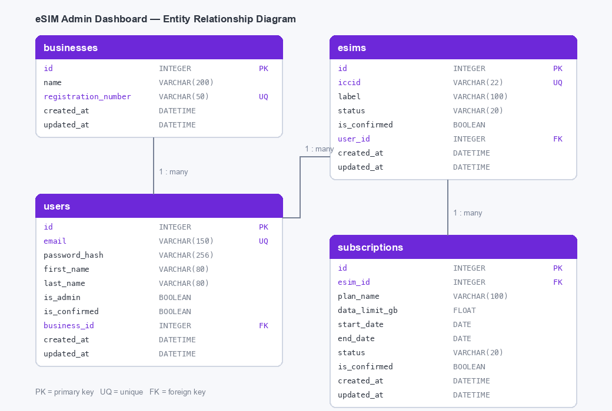

<p align="center">
  
</p>

<p align="center">
  <strong>A Flask web application for managing eSIMs, subscriptions, users and businesses.</strong><br />
  Two user roles, an admin approval workflow, and 384 automated tests behind a CI/CD pipeline.
</p>

<p align="center">
  <a href="https://agile-assignment.onrender.com"></a>
</p>

<p align="center">
  
  
  
  
  
</p>

<p align="center">
  <a href="#try-it">Try it</a> ·
  <a href="#the-story">The story</a> ·
  <a href="#what-it-does">What it does</a> ·
  <a href="#how-it-is-built">How it is built</a> ·
  <a href="#the-assignment-brief">The brief</a> ·
  <a href="#marking-scheme">Marking scheme</a>
</p>

<p align="center">
  
</p>

> [!NOTE]
> The live demo runs on Render's free tier. The first request after a quiet spell takes about 50 seconds to wake the service; after that it is fast.

---

## The story

**This was my first Python project.**

It was built for **Software Engineering and Agile (QAC020N227S)**, a Level 5, 20-credit module on my digital and technology solutions degree apprenticeship. The brief asked for a non-trivial web database application, built with an Agile approach and backed by a written report.

I chose eSIM and subscription management because it is the domain I work in, so I already understood the shape of it: businesses have users, users hold eSIM profiles, and each eSIM carries connectivity subscriptions. Coming from JavaScript, the interesting part was learning how Python and Flask do things — blueprints instead of routers, SQLAlchemy models instead of hand-written SQL, decorators for access control, and pytest for testing.

The features that taught me the most were the ones the brief never asked for: an admin confirmation gate for self-registered users, request-and-approve flows for eSIMs and top-ups, structured request logging, and a pipeline that runs the tests on every push and redeploys when they pass.

---

## Built the Agile way

The module is as much about *how* the application was built as what it does, so the work was planned and delivered using Agile practices rather than written in one go.

| Practice | How it was used here |
| --- | --- |
| **User stories** | Requirements were framed from the user's point of view instead of as technical specifications — for example, *“As a regular user, I want to request an eSIM so that I can gain access to service.”* Each story doubled as the acceptance criteria for the feature. |
| **Sprints** | Work arrived in short increments. The first sprint covered authentication and role-based access — models, routes, validation and tests — and later sprints added the admin CRUD screens, the request-and-approve flows, and observability. |
| **Kanban board** | A board tracked feature work next to the reactive fixes thrown up by testing and deployment, keeping work in progress visible rather than implicit. |
| **Continuous integration and delivery** | Every push runs the full test suite, and a green `main` redeploys automatically, so each increment is genuinely shippable instead of being saved for one big release. |

Being straight about it, and as the accompanying report concludes: the user stories and sprint goals were applied informally rather than systematically, which made the Agile side harder to evidence than the code. [Task 2 of the brief](#the-assignment-brief) asks for precisely that kind of reflection.

---

## What it does

| Role | What they can do |
| --- | --- |
| **Regular user** | Register, log in, view their own eSIMs and subscriptions, request a new eSIM or a data top-up, edit their profile |
| **Admin** | Everything above, plus full create, read, update and delete on users, businesses, eSIMs and subscriptions, and approval of pending requests |

Self-registered accounts start unconfirmed. Until an admin confirms them they are held on a pending page, which keeps casual sign-ups out of the real data.

> The two roles are a **requirement of the brief**, not decoration. It asks for admin and regular users who both register and log in, where admins perform every CRUD operation while regular users are limited to create, read and update. Here, only admins reach `/admin/...`, delete records or approve requests; regular users read their own data, raise requests and update their profile, but never delete. The check is a decorator on every admin view in `app/admin/routes.py`, covered by `tests/test_permissions.py`.

---

## Try it

### On the live demo

| Account | Email | Password | What it shows |
| --- | --- | --- | --- |
| **Admin** | `admin@example.com` | `admin1234` | The admin portal, pending approvals and full CRUD |
| **User** | `user@example.com` | `Demo@1234` | A regular user's eSIMs, subscriptions and requests |
| **Pending** | `pending@example.com` | `Demo@1234` | The confirmation gate an unapproved account sees |

The hosted database was seeded before the demo password changed, so the admin account still uses the older `admin1234`. Seed your own database and every account uses `Demo@1234`.

### On your machine

```bash
git clone https://github.com/Alex90Jennings/agile-assignment
cd agile-assignment

python -m venv venv
source venv/bin/activate          # Windows: venv\Scripts\activate
pip install -r requirements.txt

cp .env.example .env              # then set your own SECRET_KEY
python seed.py                    # creates the tables and demo data
flask run                         # http://127.0.0.1:5000
```

`seed.py` drops and recreates every table, then inserts 10 businesses, 13 users, 10 eSIMs and 22 subscriptions — some deliberately left pending so the approval screens have something to show.

> [!TIP]
> On macOS, port 5000 is usually taken by AirPlay Receiver. Use `flask run --port 5001`, or turn AirPlay Receiver off in System Settings.

### Running the tests

```bash
pytest -v
```

384 tests across 14 modules, covering models, validation, permissions, the approval flows, the admin screens and logging. They run against an in-memory SQLite database, so your development data is untouched.

---

## How it is built

| Layer | Choice |
| --- | --- |
| **Framework** | Flask, split into `auth`, `main` and `admin` blueprints |
| **Database** | SQLAlchemy models — SQLite in development, PostgreSQL (Neon) in production |
| **Auth** | Flask-Login with Werkzeug password hashing |
| **Validation** | Server-side helpers in `app/utils/validation.py` |
| **Templates** | Jinja2 with a shared layout and macros |
| **Observability** | Request timing, structured logs, custom 400/403/404/500 pages, `/health` |
| **Tests** | pytest — 384 tests |
| **CI/CD** | GitHub Actions: tests on every push, deploy to Render when `main` is green |

```
assignment/
├── app/
│   ├── __init__.py          # app factory, logging, confirmation gate
│   ├── models.py            # Business, User, ESim, Subscription
│   ├── extensions.py        # db and login manager
│   ├── observability.py     # request hooks and error handlers
│   ├── auth/                # register, login, logout
│   ├── main/                # user dashboard, profile, requests
│   ├── admin/               # CRUD and approvals
│   ├── templates/
│   └── static/
├── tests/                   # 14 test modules
├── docs/                    # ERD, banner and demo recording
├── config.py                # development, testing and production config
├── seed.py                  # demo data
└── run.py                   # entry point
```

### The database

<p align="center">
  
</p>

A business has many users, a user has many eSIMs, and an eSIM has many subscriptions. Deleting a user removes their eSIMs; deleting an eSIM removes its subscriptions.

---

## The assignment brief

The module is assessed by one piece of coursework worth 100%, split across three tasks plus academic conventions.

| Task | Weight | What it asks for |
| --- | :--: | --- |
| **Task 1 — Web development project** | 60% | Build and test the application against the requirements below, using an Agile approach |
| **Task 2 — Report on the development** | 10% | Explain three Agile elements used (user stories, sprints, Kanban boards and the like) with evidence |
| **Task 3 — Agile overview** | 20% | Compare and critically evaluate a chosen Agile framework against two others, and propose an improvement for your organisation |
| **Academic conventions** | 10% | Structure, argument, Harvard referencing and use of language |

<details>
<summary><strong>Requirements for the application</strong></summary>

<br />

- Design, develop and test a **web database application in Python**, using any framework.
- Include a **relational database with at least two tables**, each holding **10 records** for testing, with a variety of data types and proper **primary and foreign keys**.
- Provide **two user roles**, admin and regular, both of which must **register and log in**.
- All users can explore records from the database tables.
- **Admins** perform all CRUD operations; **regular users** create, read and update only.
- **Validate** input so invalid operations are impossible, with **clear error messages** when rules are broken.
- Follow **modular design**, sensible naming, indentation, comments and refactoring.
- Consider **usability**: confirm destructive actions, and tell the user whether an action succeeded.

**Evidence required:** a report with a problem statement, scope, design documents, an ERD, an explanation of the structure and techniques, annotated screenshots, an end-user manual and instructions for running the application — plus the source code (public repository or ZIP) and the application hosted on a free cloud platform.

</details>

---

## Marking scheme

Each task is marked across six bands:

| Band | Outstanding | Excellent | Very good | Good | Pass | Poor |
| --- | :--: | :--: | :--: | :--: | :--: | :--: |
| **Mark** | 80–100% | 70–79% | 60–69% | 50–59% | 40–49% | 0–39% |

For **Task 1**, the top band asks for an application that meets or surpasses every requirement: code following SOLID principles, considered usability, refactoring that removes duplication, validation of all data to the highest standard, sound error logging, correct storage and retrieval, and a report with a clear problem statement and all the necessary design documents. Lower bands step this down — a "Good" application meets the key requirements with some gaps in validation and refactoring, while a "Poor" one may not run at all.

**Tasks 2 and 3** are marked on how well the Agile elements and the framework comparison are described, evidenced and critically evaluated. **Academic conventions** rewards presentation, the range of literature used, and accurate Harvard referencing.

### How this project answers the brief

| Requirement | Where it lives |
| --- | --- |
| At least two tables, 10 records each | Four tables; `seed.py` loads 10 businesses, 13 users, 10 eSIMs and 22 subscriptions |
| Primary and foreign keys, varied types | `app/models.py` — integers, strings, booleans, floats, dates and timestamps |
| Two roles, both registering and logging in | `app/auth/routes.py`, with `is_admin` and the confirmation gate in `app/__init__.py` |
| Admin CRUD, restricted regular users | `app/admin/routes.py` and `app/main/routes.py` |
| Validation and error messages | `app/utils/validation.py`, flash messages and error templates |
| Modular design | Blueprints, shared utilities and template macros |
| Hosted application and source control | Render deployment, GitHub source, tested and deployed by GitHub Actions |

---

## Deployment

The app runs on Render with a Neon PostgreSQL database. GitHub Actions runs `pytest` on every push (`ci.yml`); when a push to `main` passes, `cd.yml` calls the Render deploy hook held in the `RENDER_DEPLOY_HOOK_URL` secret.

<details>
<summary><strong>Deploying your own copy</strong></summary>

<br />

Create a Neon database and a Render web service pointing at the repository, set the environment variables below, and use `gunicorn run:app` as the start command.

| Variable | Purpose | Example |
| --- | --- | --- |
| `SECRET_KEY` | Signs the session cookie | a long random string |
| `DATABASE_URL` | Database connection string | `sqlite:///dev.db` |
| `FLASK_ENV` | Which config to load | `development` or `production` |

Connections use `pool_pre_ping` and `pool_recycle`, so a connection dropped by the hosted database is replaced instead of failing the next request.

</details>

---

<p align="center">
  Built for a Level 5 apprenticeship module · My first Python project
</p>
